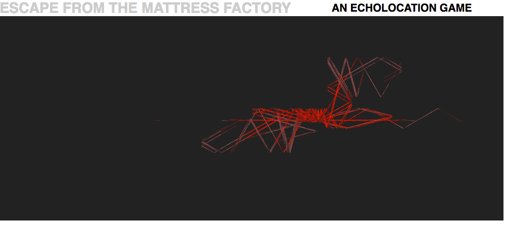

# Escape from the Mattress Factory
A browser based echolocation game. Integrates an object-oriented Javascript game structure with the smooth rendering of HTML5 canvas to create an unusual and curious experience.

[play here](samblyon.github.io/mattressFactory)



## Gameplay

A massive power outage has struck the eerie industrial complex, leaving you a chance at last to break for freedom. Use sound waves to navigate darkened factory floors in your bid to escape, avoiding obstacles and searching for an elusive exit.

In the darkness, the factory seems empty... or is it?

## Implementation

### Basic Rendering

A `GameView` class renders the game, using a `requestAnimationFrame` loop to maintain a constant 60fps refresh rate.

```javascript
// game_view.js

// Request another animation or break if player won / lost
if (this.playerEscaped()){
  if (this.level <= 5) {
    this.passCallback();
  } else {
    this.winningCallback();
  }
} else if (this.playerKilled()){
  this.losingCallback();
} else {
  requestAnimationFrame(this.step.bind(this));
}
```
The `GameView` delegates rendering tasks to the `Map`, which keeps track of all objects in the game. The `Map` further delegates rendering of individual objects (`Player`, `Ray`s and `other mysterious things you'll discover`) to the objects themselves, each of which have their own `#draw` method.

The game canvas sizes itself dynamically based on `window.innerWidth` and `window.innerHeight`. To ensure levels display at scale, positions for each level are *scalar* values rather than *absolute* values:
```javascript
// map.js

// Make dimensions relative sizes so can scale
Map.LEVELS = {
  1: {
    walls: [
              [0, 0, 0.01, 1],
              [0, 0.35, 0.75, 0.4],
              [0, 0.6, 0.6, 0.65],
              [0.7, 0.35, 0.75, 1],
              [0.55, 0.65, 0.6, 1]
            ],
    playerStart: {x: 0.05, y: 0.47}
  },
  2: {
    walls: [
```

### Displaying Sound
Players see sound as `Rays`. To be realistic, rays must fade away with time, reflect off of surfaces, and represent the objects that produce them. I approached these challenges in the following ways:

1. To give rays finite energy, they limited by a length parameter `this.maxLength`, and a lifespan parameter `age`. Each render, `length` and `age` are incremented and compared to the `Ray::LIFESPAN` and `Ray.MAX_LENGTH` constants to determine if they should be faded out. Fading out is achieved via `ctx#createLinearGradient`:
```javascript
  // ray.js

  const grad = ctx.createLinearGradient(
    this.head.x, this.head.y,
    this.tail.x, this.tail.y
  );

  if (this.age > Ray.LIFESPAN - 100) {
    headColor = this.colors.FADING_HEAD_COLOR;
  }
```

2. `Rays` bounce! When rays collide with other objects, a new child ray is created to represent the reflection. At each step, the current ray is assessed for collision by exploring outward on each axis of the ray's intended next location and calling `Map#collidingWithWall`. The `direction` of the ray is inverted depending on the direction of collision, and the reflection 'age' is advanced to the `age` of the parent ray so it will fade when its parent would have.
```javascript
  // ray.js

  // Reflect direction based on collision
  const reflectionDirection = new Coord(this.direction.x, this.direction.y);
  if (xCollision) {
    reflectionDirection.x = -reflectionDirection.x;
  } else if (yCollision) {
    reflectionDirection.y = -reflectionDirection.y;
  } else {
    reflectionDirection.y = -reflectionDirection.y;
    reflectionDirection.x = -reflectionDirection.x;
  }
```
Result:

3. `Rays` represent different kinds of sound. I chose to display different sound origins with different colors.

### Movement
Unnamable, non-player characters in the game move relative to the player's location, computed as a unit vector. Characters follow the current player using unit-vector logic:

```javascript
  currentCourse(){
    const vector = [
      this.map.player.pos.x - this.pos.x,
      this.map.player.pos.y - this.pos.y
    ];

    const magnitude = Math.sqrt(
      Math.pow(vector[0], 2) + Math.pow(vector[1], 2)
    );

    const unitVector = vector.map(coordinate => {
      return coordinate / magnitude;
    });

    return new Coord(unitVector[0], unitVector[1]);
  }
```

If a pursuer is unable to move directly toward the player, it follows the player along any unobstructed axis. 

```javascript
  move(){
    if (this.active) {
      const dir = this.currentCourse();
      const newX = this.pos.x + (dir.x * Monster.SPEED)
      const newY = this.pos.y + (dir.y * Monster.SPEED)
      let exploreCoord = new Coord(newX, newY);

      if (this.map.collidingWithWall(exploreCoord)) {
        exploreCoord = new Coord(
          this.pos.x + (dir.x * Monster.SPEED),
          this.pos.y
        )
        if (this.map.collidingWithWall(exploreCoord)){
          exploreCoord = new Coord(
            this.pos.x,
            this.pos.y + (dir.y * Monster.SPEED)
          )
        } if (this.map.collidingWithWall(exploreCoord)) {
          return;
        }
      }

      this.pos = exploreCoord;
    }
  }
};
```

## Future Improvements

### Auto generation of levels
Hand made levels take forever, so I plan to look into random generation algorithms (e.g. Conways Game of Life) to produce level maps.

### Maze Solving AI
The computer will do stupid things right now like follow the player to the right even if the best way to get the player is to go left. The next step here is to switch the computer players over to a maze solving algorithm (e.g. BF tree traversal).

### Ray rendering performance
Currently canvas performance begins to degrade when the number of rays approaches 900--not uncommon during fitful traipses across factory floors on levels 3-6.

The bottleneck is collision handling. To reduce the computational load, I tried several methods to gracefully cut down the number of active rays, for example:
```javascript
  // map.js
  if (this.rays.length > 900) {
    this.rays = this.rays.slice(300);
  }
```
However, methods to early-cancel or simply remove rays created unpleasant visual effects that were not worth the tradeoff.

In the future I'd like to build in a `quad tree` or `spatial hashing` strategy to reduce the number of collision checks in a 2D plane, as explained [here](http://zufallsgenerator.github.io/2014/01/26/visually-comparing-algorithms/).
